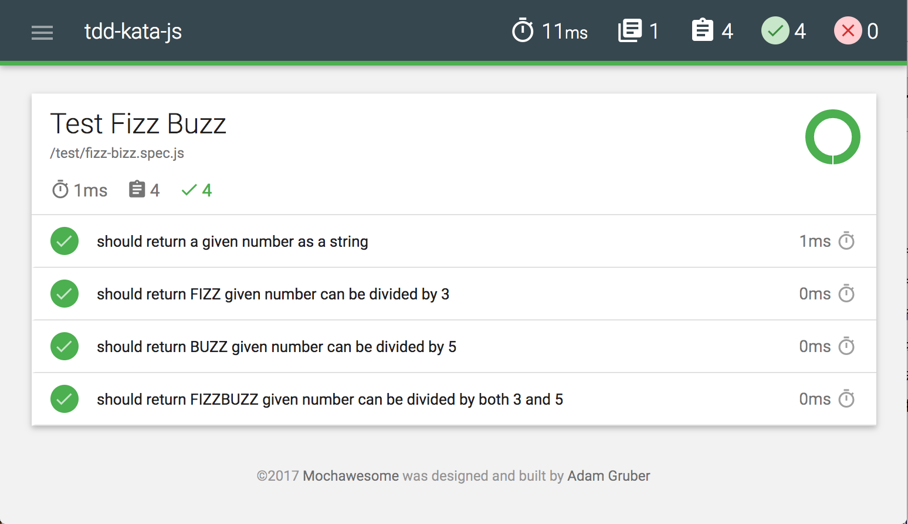

# tdd-kata-js

## Get Started

Make sure you installed Node

```
npm install  # install dependencies
npm test  # run test and generate the report
```

To checkout the test report: open `mochawesome-reports/mochawesome.html`

## Practice 1: [FizzBuzz](http://codingdojo.org/kata/FizzBuzz/)

